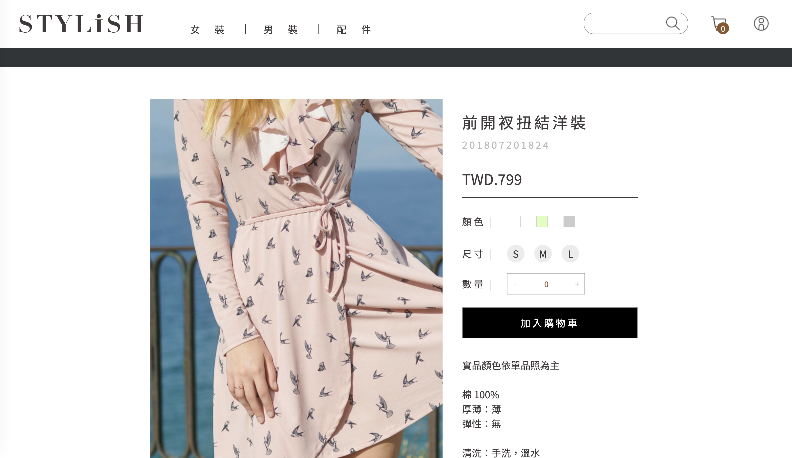
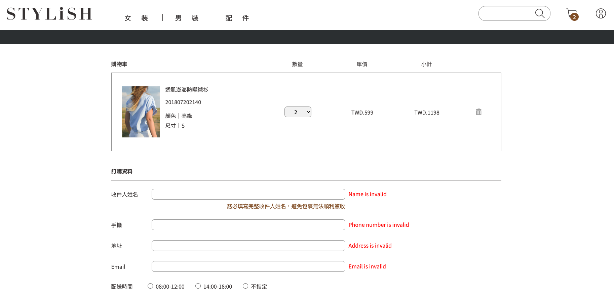

  

# STYLiSH

A stylish e-commerce store with budget-friendly prices.

## About

- Completed the entire website's UI based on the Figma design.
- Implemented Fetch API based on the API documentation from AppWorks School.
- Designed and implemented the carousel and infinite scrolling features using Vanilla JS.
- Used Firebase to deploy the website.

## Demo

### Home page

    

### Product Page

    

### Cart Page

    

